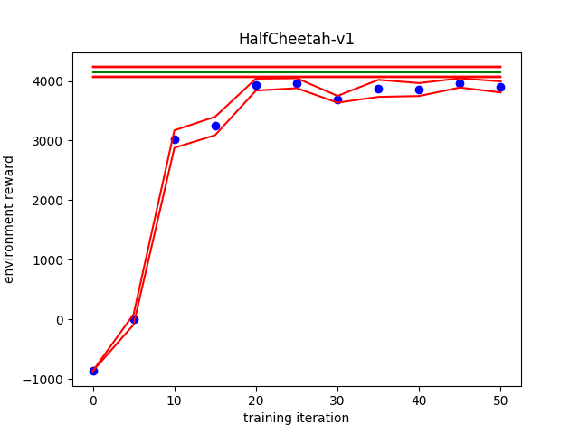
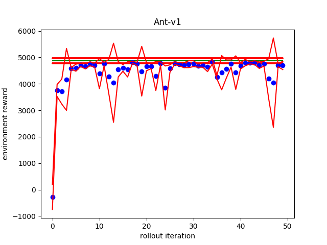

# Results
Green lines indicate expert benchmarks, blue dots indicate average performance at iteration, red lines indicate standard deviation at iteration.

## Behavioral Cloning
Run `./make_clone_results.bash` to recreate the graphs

## Dagger
Sample a larger distribution of states to learn how to react when the observations deviate from the optimum. Instead of learning by only observing experts, perform actions with the learner model, record expert actions, but perform learner actions. Then train on the expert actions in batches. In theory, the learner model should converge to the expert model.
Run `./make_dagger_results.bash` to recreate the graphs below

